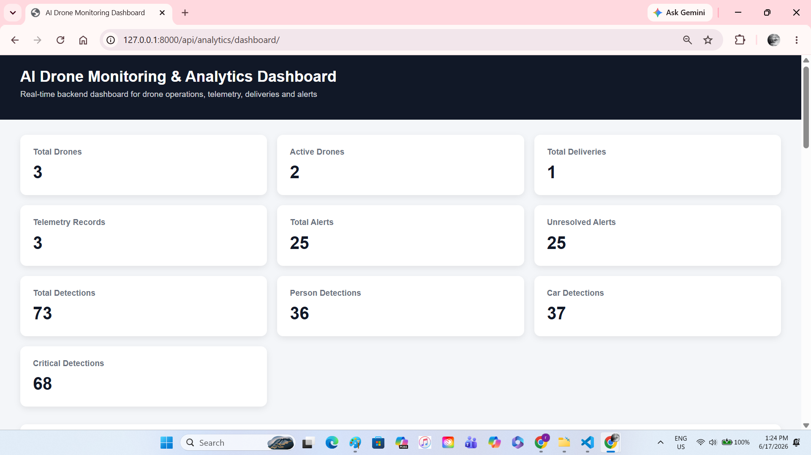
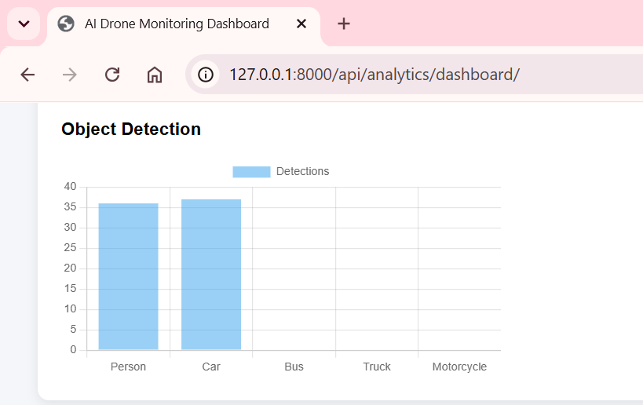
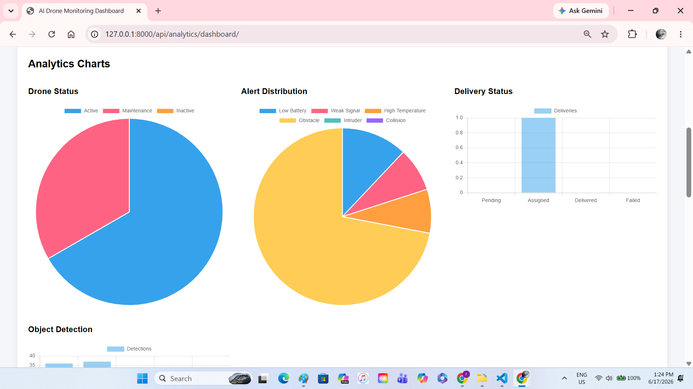
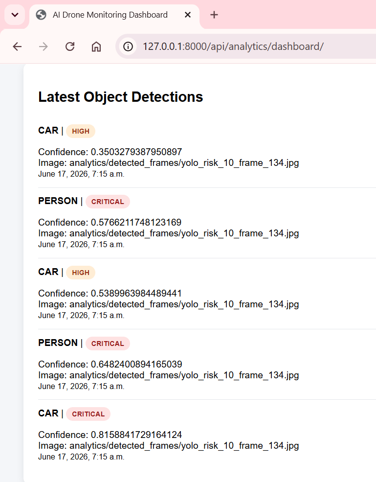
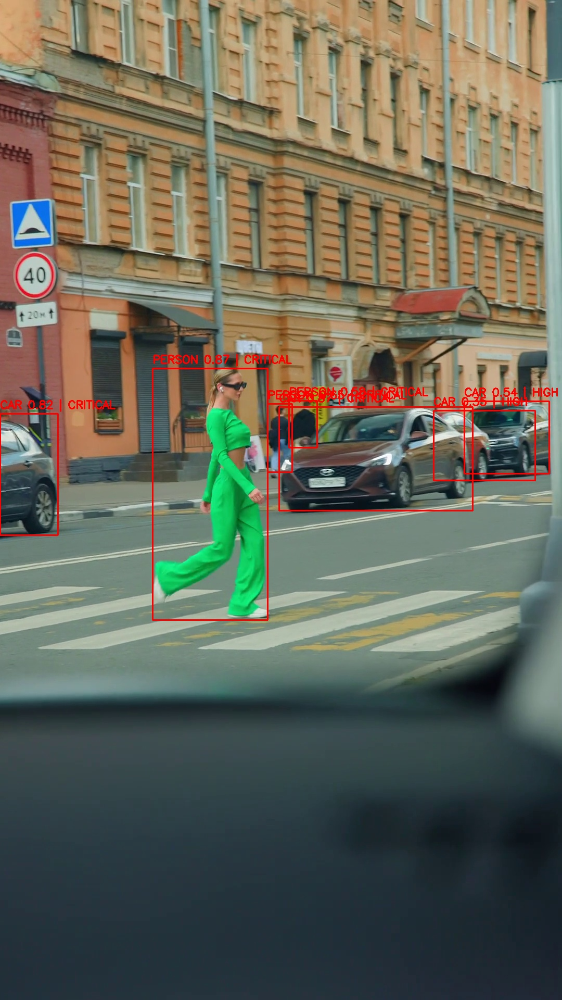
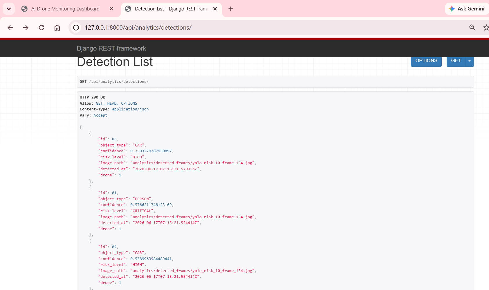

# AI Drone Monitoring & Analytics System

## Overview

AI Drone Monitoring & Analytics System is a backend-driven surveillance and monitoring platform built using Django, Django REST Framework, OpenCV, and YOLOv8.

The platform simulates real-world drone operations by combining fleet management, telemetry monitoring, object detection, alert generation, risk assessment, evidence storage, and analytics dashboards into a unified system.

This project demonstrates backend engineering, REST API development, database design, computer vision integration, risk analysis, and analytics visualization.

---

# Key Features

## Drone Management

* Register and manage drone fleet information
* Track drone operational status
* Active, Inactive and Maintenance monitoring
* Fleet-wide analytics

## Delivery Management

* Create delivery missions
* Assign deliveries to drones
* Track delivery lifecycle
* Delivery status analytics

## Telemetry Monitoring

* Battery monitoring
* Signal strength monitoring
* Temperature monitoring
* Telemetry record storage
* Operational health tracking

## Alert Management

Automatic alert generation for:

* Low Battery
* Weak Signal
* High Temperature
* Obstacle Detection
* Intruder Detection
* Collision Risk Warnings

---

# Computer Vision & AI Detection

Integrated YOLOv8 object detection for:

* Person Detection
* Car Detection
* Truck Detection
* Bus Detection
* Motorcycle Detection
* Bicycle Detection
* Bird Detection
* Animal Detection

Detected objects are analyzed and classified using a custom risk scoring engine.

---

# Risk Assessment Engine

Each detected object is evaluated using:

* Object Type Priority
* Detection Confidence
* Object Size
* Relative Position in Frame

Generated Risk Levels:

* LOW
* MEDIUM
* HIGH
* CRITICAL

Top-risk frames are automatically saved as evidence.

---

# Analytics Dashboard

The platform provides real-time operational analytics.

## Drone Analytics

* Total Drones
* Active Drones
* Maintenance Drones
* Inactive Drones

## Delivery Analytics

* Pending Deliveries
* Assigned Deliveries
* Delivered Deliveries
* Failed Deliveries

## Telemetry Analytics

* Total Telemetry Records
* Battery Monitoring
* Signal Monitoring
* Temperature Monitoring

## Alert Analytics

* Low Battery Alerts
* Weak Signal Alerts
* High Temperature Alerts
* Obstacle Detection Alerts
* Intruder Detection Alerts
* Collision Warning Alerts

## Object Detection Analytics

* Total Detections
* Person Detection Count
* Vehicle Detection Count
* Critical Detection Count
* Detection History Tracking

---

# Dashboard Preview

## Main Analytics Dashboard



## Object Detection Analytics



## Alert Distribution Analytics



## YOLO Detection Output




## Detection API Output



---

# Sample Detection Output

| Object Type | Confidence | Risk Level |
| ----------- | ---------- | ---------- |
| Person      | 0.87       | Critical   |
| Person      | 0.68       | Critical   |
| Car         | 0.82       | Critical   |
| Car         | 0.54       | High       |

---

# System Workflow

Video Feed
↓
YOLOv8 Detection Engine
↓
Object Classification
↓
Risk Scoring Engine
↓
Alert Generation
↓
Evidence Frame Storage
↓
Database Persistence
↓
Analytics Dashboard

---

# REST APIs

## Drone APIs

```text
/api/drones/
/api/drones/<id>/
```

## Delivery APIs

```text
/api/deliveries/
/api/deliveries/<id>/
```

## Telemetry APIs

```text
/api/telemetry/
/api/telemetry/<id>/
```

## Alert APIs

```text
/api/alerts/
/api/alerts/<id>/
```

## Analytics APIs

```text
/api/analytics/summary/
/api/analytics/dashboard/
/api/analytics/detections/
```

---

# Tech Stack

## Backend

* Python
* Django
* Django REST Framework

## Database

* SQLite

## Computer Vision

* OpenCV
* YOLOv8 (Ultralytics)

## Frontend

* HTML
* CSS
* Chart.js

## Development Tools

* Git
* GitHub
* VS Code

---

# Project Outcomes

* Developed a complete drone monitoring platform using Django and DRF
* Built multiple REST APIs for drone operations and analytics
* Integrated YOLOv8-based object detection and risk analysis
* Implemented automated alert generation and evidence storage
* Created an analytics dashboard with operational KPIs and visualizations
* Stored and analyzed object detection history for surveillance monitoring
* Combined backend development, database design, computer vision, and analytics into a single production-style project

---

# Future Enhancements

* Live Video Streaming
* Real-Time Object Detection
* PostgreSQL Migration
* AWS Deployment
* Multi-Drone Fleet Management
* WebSocket-Based Live Alerts
* Live Telemetry Dashboard
* Route Optimization Engine
* Object Tracking (DeepSORT)
* Geospatial Mapping and GPS Visualization

---

# Author

**Priyanka Rathore**

Python Developer | Backend Development | Computer Vision | REST APIs | Analytics Systems

